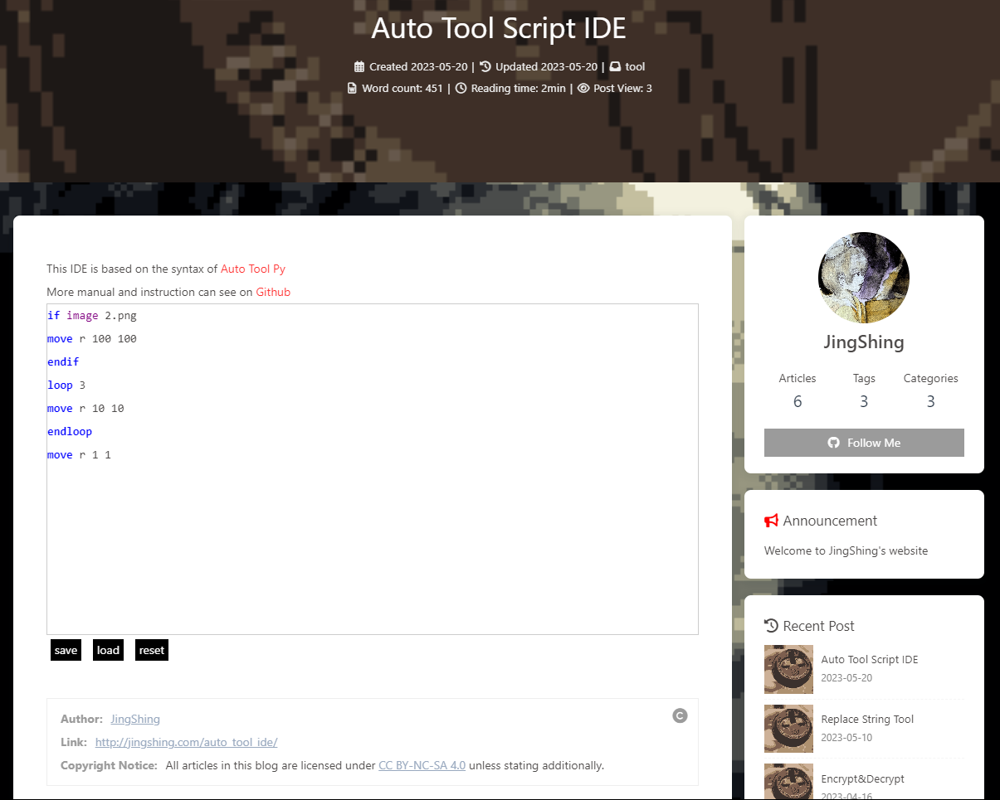

[English](README.md) | 繁體中文
# 自動按鍵工具
一個可以模擬鍵盤和滑鼠操作的工具，用 python 製作。可以偵測圖片移動滑鼠，且可以進行基礎判定和迴圈功能。
## [線上 IDE](https://jingshing.com/auto_tool_ide/) 現正供應中！

> 一個可以協助編寫此自動工具腳本的工具： [線上編輯器](https://jingshing.com/auto_tool_ide/)

### 前置
* ```pip install keyboard```
* ```pip install pyautogui```
* ```pip install pillow```
## 說明
## 語法
> 可以使用 '#' 寫註解

> 例： ```#loop 10``` 跑的時候不會跑此迴圈
* 鍵盤操作
  * key 字串
  * press key_name
  * hold key_name
  * release key_name
  > 所有可用的 key_name 可於下方查表
* 滑鼠操作
  * 移動
    * move relative(r) dx dy
    * move absolute(a) x y
    * move image(i) image_path
  * 點擊
    * click left/right/middle
    * click left/right/middle N
    * click left/right/middle hold
    * click left/right/middle release
    * click left/right/middle hold release
  * 滾動
    * scroll up/down
    * scroll up/down amount
* 休眠
  * sleep N
* 迴圈
  * loop N
  * endloop
* if狀態
  * if image file_path
  * if mouse px py
  * endif
* 退出
  * exit

## 語法手冊
> 可以使用 '#' 寫註解

> 例： ```#loop 10``` 跑的時候不會跑此迴圈
* 鍵盤操作
  * key 字串
  > 模擬鍵盤輸入此字串
  * press key_name
  > 按鍵盤按鍵一次
  * hold key_name
  > 按住鍵盤按鍵
  * release key_name
  > 鬆開鍵盤按鍵
  > 
  > 所有可用的 key_name 可於下方查表
* 滑鼠操作
  * move
  > 這個指令可以移動滑鼠鼠標
    * move relative(r) dx dy
    > 相對座標移動
    * move absolute(a) x y
    > 移動到絕對座標
    * move image(i) image_path
    > 移動到屏幕上偵測的給定圖片中心，如果沒找到圖片，則不會移動
  * click
  > 點擊滑鼠按鍵
    * click left/right/middle
    > 點擊一次
    * click left/right/middle N
    > 點擊 N 次
    * click left/right/middle hold
    > 按住按鍵
    * click left/right/middle release
    > 鬆開按鍵
    * click left/right/middle hold release
    > 按住再鬆開
  * scroll
  > 滑鼠滾動
    * scroll up/down
    > 滾動一次
    * scroll up/down amount
    > 滾動 N 次
* 休眠
> 這個語法，將能使指令間停頓
  * sleep N
  > 等待 N 秒
* 迴圈
> 迴圈是一個特殊語法，可以組合其他語法使用，且具備區塊的特性，所以需要 end 來判定
  * loop N
  > 重複 N 次。如果 N = -1 則為無窮迴圈，無窮迴圈可以按 esc 來取消。
  * endloop
  > 在迴圈結尾，需要此來標註迴圈結束位置
* if 狀態
  * if image file_path
  > 偵測圖片有沒有在屏幕上，有的話會跑底下區塊的內容
  * if mouse px py
  > 偵測滑鼠是否在特定的座標
  * endif
  > 如果區塊結束，要放置此來提示 if 區塊的結束
* exit
> 停止腳本

## all key_name available

* a, b, c, ...: 單個字母鍵

* 1, 2, 3, ...: 數字鍵

* F1, F2, F3, ...: 功能鍵

* space: 空格鍵

* enter: 回車鍵

* tab: 制表鍵

* shift: Shift鍵

* ctrl: Ctrl鍵

* alt: Alt鍵

* caps lock: 大寫鎖定鍵

* esc: Escape鍵

* backspace: 倒退鍵

* delete: 刪除鍵

* home: Home鍵

* end: End鍵

* page up: Page Up鍵

* page down: Page Down鍵

* left arrow: 左方向鍵

* right arrow: 右方向鍵

* up arrow: 上方向鍵

* down arrow: 下方向鍵

## 紀錄
### Ver0.1
* 功能:
  * GUI
    * 編輯檔按
    * 存讀檔
    * 運行
  * 基礎語法
    * 迴圈
    * if 判斷
    * 按鍵
    * 移動
    * 休眠
    * 離開
  * 讀檔
  * 存檔
### Ver0.2
* [線上編輯器](https://jingshing.com/auto_tool_ide/)
* 功能:
  * 更動: loop end 更改為 endloop
  * 移除 gui 的 input 功能

## TODO
- [X] if else: to detect image and to do something
- [ ] count
- [ ] not bool
- [ ] record
- [ ] support excel
- [x] gui
- [ ] generate instruction file
- [x] comment
- [ ] run other file
- [ ] jump
- [ ] exec
- [x] ide
